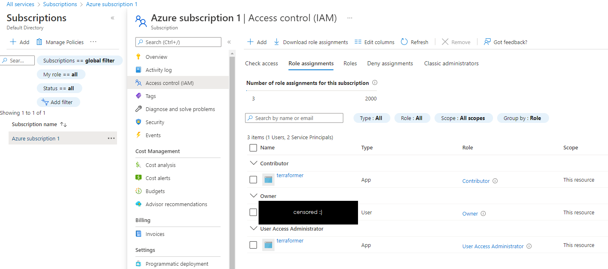

# Infrastructure for Zühlke Camp 2022 project

This repo contains the [Terraform](https://www.terraform.io) configuration files used to create
the [Azure](https://azure.microsoft.com/en-us/) resources used for my 2022 camp project.

## Prerequisites

In order for Terraform to be able to do its thing, it needs an Azure service principal, which
must be created manually (e.g. via the Azure CLI, or directly in the web interface).

The service principal must then have the roles "Contributor" and "User Access Administrator"
to be able to create/modify/delete resources, and assign and modify roles.

### Web-interface Step-by-Step

To create the service principal in the web interface, first create an app registration in Azure AD
(preferably with a name indicating its purpose).


Then create client credentials for the app registration (i.e. the client secret), and make sure to
copy or write down the secret value (it cannot be retrieved later, only directly after creation).

The client secret and client ID (also called Application ID) are the credentials Terraform uses
to log in and modify resources. They need to be passed to Terraform via the
`terraformer_sp_password` and `terraformer_sp_client_id` variables.

Lastly, the service principal must get the required permissions to be allowed to
create/modify/delete resources, as well as roles and role bindings.

For this, role assignments need to be created in the Azure Subscription. Go to "Subscriptions",
select the subscription you're using, select "Access control (IAM)", and then select
"Role assignments". Finally, "Add" the required role assignments ("Contributor" and
"User Access Administrator") for the application. In the "Select members" step you might have
to search for the application's name if it is not in the list of suggested users.



### CLI Hints

Everything that can be done in the web interface can also be done via the CLI. The only thing
to watch out for is that in the web interface a service principal is automatically created when
creating an app registration. In the CLI, this is an additional step that must be performed
explicitly.

## How-To

Once the service account is set up, the easiest thing to do is to create a `secrets.tfvars` file
and store the client ID and secret for the service principal there:

```
terraformer_sp_password  = "<insert client secret here>"
terraformer_sp_client_id = "<insert client id here>"
```

Additionally, enter the values specified in [variables.tfvars](./variables.tfvars). The file can
also be renamed to something ending in `.auto.tfvars` (e.g. `variables.auto.tfvars`) to have the
values auto-applied (i.e. without explicitly specifying the var file when executing the terraform
command). For more information, see
[the Terraform docs regarding var files](https://www.terraform.io/language/values/variables#variable-definitions-tfvars-files).

Once the variables and secrets are set up (and assuming the secrets are in a file called
`secrets.tfvars`, while the other variable values are in a file ending in `.auto.tfvars`), running

```
terraform apply -var-file="secrets.tfvars"
```

should set up the infrastructure.

## Using the Infrastructure

To be able to push container images into the registry, the client ID and password for the container
registry image push service user can be shown via

```
terraform output image-pusher-client-id
terraform output image-pusher-password
```

To access the Kubernetes cluster, the Azure CLI tools can create the kubectl config file via

```
az aks get-credentials --resource-group RESOURCE_GROUP --name CLUSTER_NAME
```

The necessary names for the resource group and cluster are the values specified by the
`resource_group_name` and `cluster_name` variables. They also have associated output variables
that can be shown via

```
terraform output resource-group
terraform output cluster-name
```